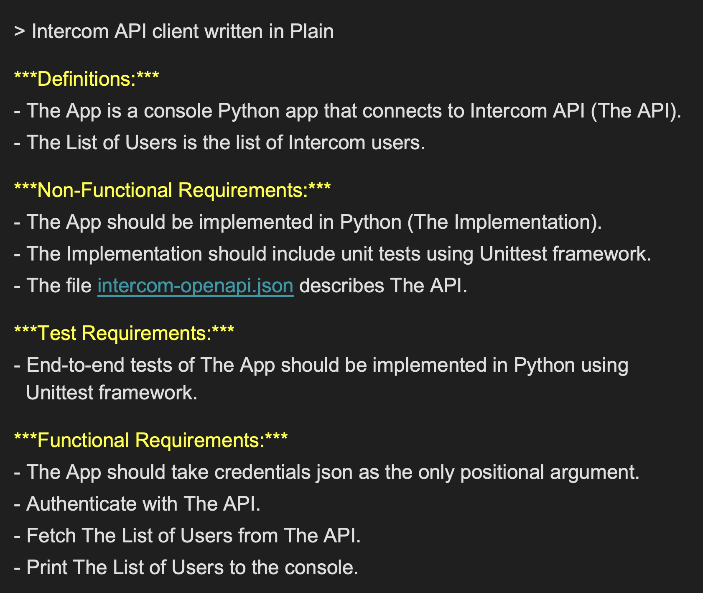

# Codeplain plain2code renderer

Render Plain source to software code using the Codeplain API.

## Codeplain.ai - Code Generation as a Service

Codeplain is a platform that generates software code using large language models based on requirements you specify in Plain specification language.

Schematic overview of the Codeplain's code generation service


### Abstracting Away Code Generation Complexity with Plain


Plain is a novel specification language that helps abstracting away complexity of using large language models for code generation.

An example application in Plain




## Getting started

### Prerequisites


#### System requirements

To run the plain2code client, you need Python 3.11 or a later version.

**Windows users:** Please install WSL (Windows Subsystem for Linux) as this is currently the supported environment for running plain code on Windows.

#### Anthropic API Key

For now you need to bring your own Anthropic API key to use Codeplain API. If you don't have Anthropic API key, you can create a free developer account at [console.anthropic.com](https://console.anthropic.com/). To experiment with Codeplain you need to top up your Anthropic account with $5-10.

With Anthropic API Key ready, please contact Codeplain.ai support at support@codeplain.ai to have the hash of your Anthropic API key added to the list of authorized API keys.

To have the hash generated use the following command:

`python hash_key.py $CLAUDE_API_KEY`

To set up your API key run:

```bash
# Export API key directly
export CLAUDE_API_KEY="your_actual_api_key_here"
```

### Installation Steps

1. Clone this repository
2. Set your Codeplain API key as an environment variable:
   ```
   export CLAUDE_API_KEY=your_api_key_here
   ```
3. (Recommended) Create and activate a virtual environment:
   ```bash
   python -m venv .venv
   source .venv/bin/activate
   ```
4. Install required libraries
   ```
   pip install -r requirements.txt
   ```

### Quick Start

After completing the installation steps above, you can immediately test the system with a simple "Hello World" example:

- Change to the example folder and run the example:
   ```
   cd examples/example_hello_world_python
   python ../../plain2code.py hello_world_python.plain
   ```

   *Note: Rendering will take a few minutes to complete.*

- The system will generate a Python application in the `build` directory. You can run it with:
   ```
   cd build
   python hello_world.py
   ```

## Additional Resources

### Examples and Sample Projects

- See the [examples](examples) folder for sample projects in Golang, Python, and React.
- For example application how to implement task manager in Plain see [example-task-manager](https://github.com/Codeplain-ai/example-task-manager) repository.
- For example application how to implement SaaS connectors in Plain see [example-saas-connectors](https://github.com/Codeplain-ai/example-saas-connectors) repository.

### Documentation

- For more details on the Plain format, see the [Plain language specification](docs/plain_language_specification.md).
- For step-by-step instructions for creating your first Plain project see the [Kickstart your plain project](Starting_a_plain_project_from_scratch.md).
- For complete CLI documentation and usage examples, see [plain2code CLI documentation](plain2code_cli_documentation.md).


